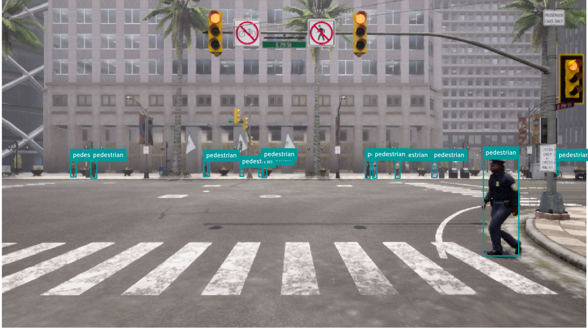

# Sim-to-Real Pedestrian Detection: CARLA to Waymo

This project builds a reproducible sim-to-real evaluation pipeline for pedestrian detection. It generates labeled RGB images in CARLA, constructs a fixed pedestrian-focused evaluation set from the Waymo Open Dataset, and uses the same YOLO-compatible dataset contract throughout. The aim is to understand **how synthetic training translates to real-world performance** and make the sim-to-real gap measurable: train only on synthetic data, then evaluate unchanged real-world data.

<p align="center">
  
</p>

## Why This Exists

Synthetic data makes it possible to control pedestrian density, visibility, weather, lighting, traffic, camera placement, and occlusion without manually labeling images. That control is useful only when paired with a disciplined real-data evaluation set. This repository therefore keeps the two datasets deliberately separate:

- **CARLA synthetic data** provides the training and validation splits.
- **Waymo evaluation data** is a fixed `test` split, derived from labeled validation contexts and never used for training.

Both use normalized YOLO pedestrian boxes, image/label pairing, a dataset manifest, and traceable generation or source metadata.

## Implemented Pipeline

### Synthetic Data Generation

The CARLA pipeline captures frame-aligned RGB, depth, and semantic-segmentation measurements in synchronous simulation. It labels only pedestrians that are visible according to projected 3D geometry, semantic pixels, and depth checks, then exports tight segmentation-derived or projected 3D bounding boxes in YOLO format.

All scene randomization lives in [configs/carla_synthetic.yaml](configs/carla_synthetic.yaml): pedestrian placement and distance, weather, time of day, traffic, camera settings, occlusion thresholds, deterministic seed, and scene-level train/validation split. Scene-level splitting prevents near-duplicate frames from leaking between synthetic training and validation.

### Waymo Evaluation Set

The Waymo exporter reads native `camera_image` and `camera_box` Parquet components, copies original JPEG payloads, and converts pedestrian boxes to YOLO labels. Each exported sample preserves the source context, timestamp, camera, pixel boxes, and camera-scoped Waymo object identifiers in its manifest.

Sampling is deterministic and configured in [configs/waymo_eval.yaml](configs/waymo_eval.yaml). It selects repeated appearances of camera-scoped pedestrian identities with a configurable target and cap, preserves all pedestrian labels on selected images, and adds scene-camera-balanced negative examples. This makes the evaluation subset compact, traceable, and resistant to domination by a small number of long tracks.

### Validation and Inspection

FiftyOne's YOLO importer performs the standard dataset-format validation. Project-specific checks then verify the contracts that a generic importer cannot: manifest completeness, scene isolation, pedestrian class mapping, normalized boxes, Waymo source keys, and identity-sampling constraints. Statistics are collected separately from validation so checking a dataset does not mutate it.

The shared FiftyOne integration loads either synthetic or Waymo splits for visual inspection. Its local MongoDB setup and filesystem requirement are documented in [docs/FIFTYONE_MONGODB.md](docs/FIFTYONE_MONGODB.md).

## Dataset Layout

```text
data/
├── synthetic/
│   └── carla_pedestrians/
│       ├── images/{train,val}/
│       ├── labels/{train,val}/
│       ├── dataset.yaml
│       ├── manifest.jsonl
│       └── stats.json
└── processed/
    └── waymo_pedestrian_eval/
        ├── images/test/
        ├── labels/test/
        ├── dataset.yaml
        ├── manifest.jsonl
        └── sampling_report.json
```

An empty Waymo label file is an intentional negative sample. Generated and source data are excluded from Git; the code and YAML configurations define how to reproduce them.

## Project Map

| Area | Location | Responsibility |
| --- | --- | --- |
| CARLA generation | [src/synthetic](src/synthetic) | Configuration, synchronous capture, visibility-aware labeling, writing, validation, and statistics |
| Waymo access and export | [src/dataset](src/dataset) | Parquet loading, track-sampled evaluation export, and dataset validation |
| Runtime configuration | [configs](configs) | CARLA and Waymo sampling parameters |
| Dataset documentation | [docs/SYNTHETIC_DATA.md](docs/SYNTHETIC_DATA.md), [docs/WAYMO_EVAL.md](docs/WAYMO_EVAL.md) | Data contracts and implementation details |
| Earlier LiDAR work | [src/preprocessing](src/preprocessing), [src/visualization](src/visualization) | Point-cloud preprocessing and visualization utilities |

## Minimal Use

The project targets Python 3.12+ and uses [uv](https://docs.astral.sh/uv/). Install the core environment with `uv sync`; add `--all-groups` when working with CARLA generation or Waymo export. The two narrow entry points are [scripts/generate_synthetic.py](scripts/generate_synthetic.py) for CARLA data and [scripts/export_waymo_eval.py](scripts/export_waymo_eval.py) for the Waymo test set. Their focused options and operational prerequisites are documented alongside the pipelines rather than repeated here.

## Roadmap


The data-generation and evaluation foundations are in place. The remaining work follows the original project plan:

1. Train a detector transformer on the synthetic training split and report synthetic validation metrics.
2. Evaluate the frozen model on the fixed Waymo test set to quantify the sim-to-real gap.
3. Analyze failure cases and iterate on synthetic domain randomization.
4. Package the trained perception model as a ROS 2 node and visualize detections in RViz2.

### Immediate bug fixes
- Fix label generation from CARLA to ensure that labels are within the image boundaries